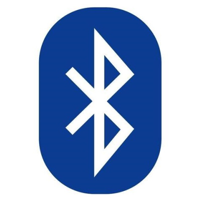

<!-- Main -->

<!-- One -->
<section id="one">
	

		<header class="major">
			<h2>Protocols</h2>
		</header>
		
Over the semester, I have been researching ways to develop Protocols into the ball-bot project. The main reason for wanting to implement protocols for a project such as this is mostly for communication purposes. Having communication from the robot without having a handicap such as a cable connection would be a great way of debugging progress with the robot, and a good way of seeing how the robot reacts to certain environments and conditions it would encounter both during the development phase and during later real-world testing with a larger scale robot.

	

</section>

<!-- Two -->
<section id="two" class="spotlights">
	<section>
		
		

			

				<header class="major">
					<h3>LoRa</h3>
				</header>
				
Nullam et orci eu lorem consequat tincidunt vivamus et sagittis magna sed nunc rhoncus condimentum sem. In efficitur ligula tate urna. Maecenas massa sed magna lacinia magna pellentesque lorem ipsum dolor. Nullam et orci eu lorem consequat tincidunt. Vivamus et sagittis tempus.

			

		

	</section>
	<section>
		
		

			

				<header class="major">
					<h3>The Things Network</h3>
				</header>
				
Nullam et orci eu lorem consequat tincidunt vivamus et sagittis magna sed nunc rhoncus condimentum sem. In efficitur ligula tate urna. Maecenas massa sed magna lacinia magna pellentesque lorem ipsum dolor. Nullam et orci eu lorem consequat tincidunt. Vivamus et sagittis tempus.

			

		

	</section>
	<section>
		
		

			

				<header class="major">
					<h3>Bluetooth</h3>
				</header>
				
Another Protocol I would like to implement, but I don't think I will be able to, is a Bluetooth connection for a Controller. The controller would allow a user to be able to control the robot, which could be expanded further on for a larger scale robot. Eventually, the idea would be to have the robot be autonomous, however during early development stages, having the robot able to balance itself while being controlled by a user would be a major stride in the development. Unfortunately, due to time constraints, along with the skill I currently have regarding building these robots, I don't think I will be able to implement this feature for showcase this year.

			

		

	</section>
</section>

